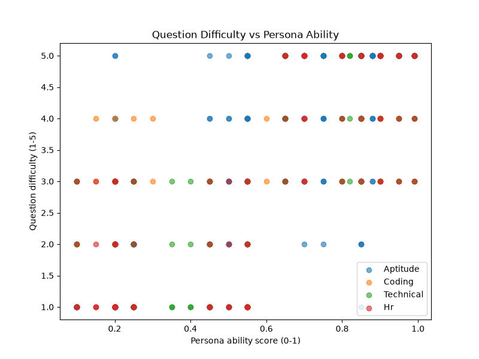

# Evaluation Report

_Generated: 2026-09-02T08:06:00.759292+00:00_

## Evaluation mode: fully OFFLINE / MOCK — no live Claude calls

Every result in this report was produced offline (Anthropic API credits are unavailable in this environment). Two distinct offline mechanisms are in play, and it matters which is which: **(a)** `tests/conftest.py`'s autouse fixtures override all four rounds' question/problem *generators* with deterministic test doubles (`FakeQuestionGenerator`, `FakeCodeProblemGenerator`, `FakeTechnicalInterviewer`, `FakeHRInterviewer`) — the same test doubles every other API test in this suite already relies on, not something added for this evaluation, and not the app's `MOCK_MODE` feature. **(b)** The Technical/HR *graders* are NOT faked by conftest.py — they go through the app's real, documented `MOCK_MODE` selection (`build_technical_independent_grader()` / `build_technical_key_validator()` and their HR equivalents), which resolves to the offline heuristic agents since `MOCK_MODE=true` here. Grading itself is a two-phase pipeline — an answer-key-blind independent draft, then a separate key-based validation step — so the grader never sees the generator's answer key until after it has scored independently; see `tests/test_grader_independence.py` for the proof. Both phases are verified directly in `tests/test_evaluation_harness.py`. **No live Claude API call occurs anywhere in this report.** Where this environment's constraints limit what could be measured (e.g. real LLM grading variance), that is stated explicitly below rather than substituted with a fabricated number.

## 1. Personas

20 synthetic personas, each with a fixed 4-round ability profile (probability of a correct/strong answer per round, used as a per-question trial — a deliberate simplification, not a full IRT model). See `evaluation/personas.py`.

| Persona | Description | Aptitude | Coding | Technical | HR | Company |
|---|---|---|---|---|---|---|
| all_rounder_high | Strong across all four rounds. | 0.95 | 0.95 | 0.95 | 0.95 | TCS_NQT |
| all_rounder_low | Weak across all four rounds. | 0.1 | 0.1 | 0.1 | 0.1 | INFOSYS |
| balanced_medium | Consistently average across all rounds. | 0.55 | 0.55 | 0.55 | 0.55 | WIPRO |
| aptitude_specialist | Excels at aptitude only; weak elsewhere. | 0.9 | 0.2 | 0.2 | 0.2 | TCS_NQT |
| coding_specialist | Excels at coding only; weak elsewhere. | 0.2 | 0.9 | 0.2 | 0.2 | INFOSYS |
| technical_specialist | Excels at technical only; weak elsewhere. | 0.2 | 0.2 | 0.9 | 0.2 | WIPRO |
| hr_specialist | Excels at HR/behavioral only; weak elsewhere. | 0.2 | 0.2 | 0.2 | 0.9 | TCS_NQT |
| coder_not_communicator | Strong technical/coding, weak HR/soft-skills. | 0.7 | 0.9 | 0.8 | 0.15 | INFOSYS |
| communicator_not_coder | Strong HR/aptitude, weak coding/technical. | 0.75 | 0.15 | 0.25 | 0.9 | WIPRO |
| crammer | Strong rote aptitude, weak applied coding/technical. | 0.85 | 0.3 | 0.35 | 0.5 | TCS_NQT |
| late_bloomer | Weak aptitude, strong coding/technical/HR. | 0.25 | 0.8 | 0.8 | 0.7 | INFOSYS |
| steady_improver | Moderate-to-good across the board. | 0.5 | 0.6 | 0.65 | 0.7 | WIPRO |
| front_loaded | Strong aptitude/coding, fades on technical/HR. | 0.85 | 0.7 | 0.4 | 0.2 | TCS_NQT |
| consistently_good | High accuracy across every round. | 0.88 | 0.85 | 0.82 | 0.8 | TCS_NQT |
| guesser | Near-chance performance everywhere. | 0.25 | 0.25 | 0.25 | 0.25 | INFOSYS |
| technical_and_hr_strong | Strong technical + HR, average aptitude/coding. | 0.55 | 0.55 | 0.85 | 0.85 | WIPRO |
| aptitude_and_coding_strong | Strong aptitude + coding, average technical/HR. | 0.85 | 0.85 | 0.55 | 0.55 | TCS_NQT |
| moderately_capable | Ability around 0.65 across all rounds. | 0.65 | 0.65 | 0.65 | 0.65 | INFOSYS |
| moderately_weak | Ability around 0.45 across all rounds. | 0.45 | 0.45 | 0.45 | 0.45 | WIPRO |
| exceptional | Near-perfect across every round. | 0.99 | 0.99 | 0.99 | 0.99 | TCS_NQT |

## 2. Round-wise results per persona

Every score below comes directly from each round's own `get_result()` — no scoring logic is reimplemented in the evaluation framework.

| Persona | Aptitude % | Coding % | Technical % | HR % |
|---|---|---|---|---|
| all_rounder_high | 100.0 | 100.0 | 100.0 | 100.0 |
| all_rounder_low | 6.67 | 0.0 | 0.0 | 0.0 |
| balanced_medium | 66.67 | 50.0 | 0.0 | 0.0 |
| aptitude_specialist | 100.0 | 50.0 | 0.0 | 0.0 |
| coding_specialist | 40.0 | 100.0 | 0.0 | 0.0 |
| technical_specialist | 13.33 | 50.0 | 100.0 | 0.0 |
| hr_specialist | 33.33 | 0.0 | 0.0 | 100.0 |
| coder_not_communicator | 60.0 | 100.0 | 100.0 | 0.0 |
| communicator_not_coder | 66.67 | 50.0 | 0.0 | 100.0 |
| crammer | 73.33 | 50.0 | 0.0 | 0.0 |
| late_bloomer | 13.33 | 50.0 | 100.0 | 100.0 |
| steady_improver | 46.67 | 100.0 | 100.0 | 100.0 |
| front_loaded | 86.67 | 100.0 | 0.0 | 0.0 |
| consistently_good | 86.67 | 100.0 | 100.0 | 100.0 |
| guesser | 26.67 | 50.0 | 0.0 | 0.0 |
| technical_and_hr_strong | 46.67 | 50.0 | 100.0 | 100.0 |
| aptitude_and_coding_strong | 80.0 | 100.0 | 0.0 | 0.0 |
| moderately_capable | 66.67 | 100.0 | 100.0 | 100.0 |
| moderately_weak | 40.0 | 0.0 | 0.0 | 0.0 |
| exceptional | 100.0 | 100.0 | 100.0 | 100.0 |

## 3. Grading score variance (same fixed answer, graded 5x)

Each round's real grader agent was called 5 times on one unchanged fixed answer. In MOCK_MODE, grading is a pure deterministic function of its inputs (keyword-overlap for Technical/HR) — **variance == 0.0 is the expected and correct result here, not a bug.** This does NOT measure real Claude grading variance, which would require live API credits that are unavailable in this environment.

| Round | Scores (5 runs) | Mean | Variance |
|---|---|---|---|
| technical | [100.0, 100.0, 100.0, 100.0, 100.0] | 100.0 | 0.0 |
| hr | [100.0, 100.0, 100.0, 100.0, 100.0] | 100.0 | 0.0 |

## 4. Difficulty vs ability

Scatter of every answered question's (persona ability, difficulty at presentation), one series per round, generated with matplotlib (`evaluation/plot.py`). A positive within-round trend demonstrates the existing adaptive-difficulty mechanism (`clamp_difficulty` in each round's taxonomy module) responding correctly to a persona's simulated correctness — this evaluation did not require any change to that mechanism.

## 5. Top 3 failure modes

### 1. Aptitude has no MOCK_MODE fallback

Unlike Coding/Technical/HR, the Aptitude round's `QuestionGeneratorAgent` (`agents/question_generator/question_generator.py`) always calls the real Anthropic API — it predates the `MOCK_MODE` pattern introduced for later rounds. Running this evaluation without Claude credits was only possible by reusing the same `FakeQuestionGenerator` test double the pytest suite already relies on (`tests/conftest.py`). **What was attempted:** no code change was made to add `MOCK_MODE` support to Aptitude — that would be out of scope for an evaluation task and would risk the explicit instruction not to modify the existing four rounds. The evaluation harness instead works around the gap at the test layer, exactly as the existing pytest suite already does for every Aptitude test.

### 2. Mock keyword-overlap grading (Technical/HR) is gameable — now scoped to phase 2 only

Grading was reworked into two phases to satisfy the grader-independence requirement ('the grader must never see the generator's answer key until after it has scored independently'): phase 1 (`MockIndependentTechnicalGraderAgent` / `MockIndependentHRGraderAgent`) never receives `model_answer`/`rubric_keywords` at all — see `tests/test_grader_independence.py` for the structural and behavioral proof. The FINAL score, however, still comes from phase 2 (`MockTechnicalKeyValidatorAgent` / `MockHRKeyValidatorAgent`, `agents/technical_interviewer/grader.py`, `agents/hr_interviewer/grader.py`), which scores by how many rubric keywords a free-text answer contains as substrings — an answer that stuffs in every rubric keyword with no real content still scores 100%, identical to a genuinely strong answer, demonstrated empirically in `tests/test_evaluation_variance.py::test_keyword_stuffed_nonsense_answer_scores_full_marks_in_mock_mode`. This is now a narrower, explicitly-scoped limitation of phase 2's offline heuristic specifically (the requirement explicitly allows the key to be used for secondary validation at this stage) — not present in the real Claude-backed phase 2. **What was attempted:** phase 2's keyword heuristic was not redesigned — it exists only as a small dev/demo fallback, and its scope is now explicit and bounded (secondary validation, after independent scoring) rather than the sole grading mechanism. This evaluation's mock-mode scores are still not over-trusted as a proxy for genuine answer quality.

### 3. Mock fixture question text is difficulty-invariant

`MockCodeProblemGeneratorAgent` / `MockTechnicalInterviewerAgent` / `MockHRInterviewerAgent` all return one fixed fixture's text unchanged regardless of the requested difficulty — only the numeric `difficulty` label attached to the response changes. So the difficulty-vs-ability plot in this (mock) evaluation reflects how responsively the adaptive-difficulty *number* tracks a persona's correctness, not genuine content-hardness scaling, which only the real Claude-generated path provides. **What was attempted:** no fix was attempted — the mock fixture banks are documented (in each generator module's own docstring) as a small, hand-verified, fixed test double; varying fixture text by difficulty would defeat their purpose as a reproducible offline fallback.
